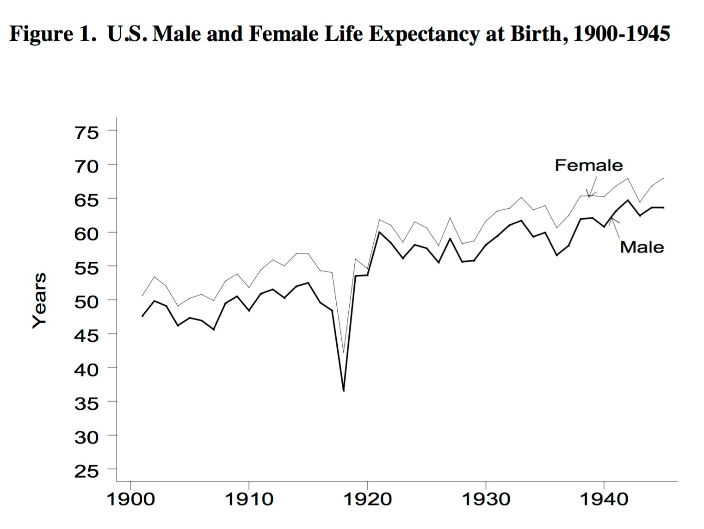

```{r setup, include=FALSE}
knitr::opts_chunk$set(echo = FALSE )
```

## About me

- Economist.
- Data Analyst, KKBOX Data science team.
- Amuture pâtissier and home chef.
 

## What is data science?


## What does data scientist do? (Reversed)

- 運用資料視覺化工具呈現研究結果
    + ggplot!
- 詮釋或利用適當的統計方法分析資料
- 取得、清洗、轉化資料
    + "If you torture the data enough, nature will always confess."(Ronald Coase, 1981)
    + [it can even be a mutual torturing activity](https://www.r-bloggers.com/a-glimpse-into-the-daily-life-of-a-data-scientist/)

## What does data scientist do? (Reversed)

- 瞭解你的資料
    + 裡面有些什麼?
    + 資料欄位代表些什麼?
    + 資料的分佈、變數間的關聯
    + 裡頭有沒有錯?
    + 也是ggplot 的用處!

## What does data scientist do? (Reversed) 
- 定義問題. (但通常是「重新定義」問題) 
    + 「這首歌會紅嗎？」 (X)
    + 「什麼數據或指標可以有效的預測歌曲熱門度？」 (O)
    
- 最重要的兩個階段，但常常都需要先探索資料才會出現好的問題
- Difference between mediocre/tedious and intriguing/great data science project


## 一圖值千金



[1918 flu pandemic](http://www.birdflubook.org/resources/brainerd1.pdf)


## 環境
```{r environment, echo=T, message=TRUE}
library(tidyverse)
```

## 讀入資料 {.build}
- [臺北市政府警察局交通警察大隊/交通事故資料](http://data.taipei/opendata/datalist/datasetMeta?oid=2f238b4f-1b27-4085-93e9-d684ef0e2735)
- 使用**readr**的**read_csv**函數，而不是內建的**read.csv**
```{r read, echo=T, message=F}
traffic <- read_csv("traffic_eng.csv")
head(traffic, n=3)
```

## 探索資料　 {.build}
- 看一下時間分佈好了　
```{r explore hour, echo=T, message=F}

traffic %>%
    select(time.month, time.day, time.hour, time.minute) %>%
    summary()
    
```
- 看的出來是24小時制的紀錄方式，但如果想知道整體分配，這樣好像沒什麼感覺

## 探索資料　 {.build}
- 每小時的分配次數?

```{r explore hour 2, echo=T, message=F}

traffic %>%
    group_by(time.hour) %>%
    count() -> pivot.time.hour
pivot.time.hour %>% head(5)
```
- 5個值的話還好，24個呢? 60? 365?


## 探索資料, your first ggplot 
```{r ggplot hour, echo=T, message=F}

qq <- ggplot(data = pivot.time.hour)
qq <- qq + geom_bar(aes(x=time.hour, y=n), stat = "identity")
print(qq)
```


## 探索資料, your first ggplot 

```{r ggplot hour 2, echo=T, message=F, eval=F}

qq <- ggplot(data = pivot.time.hour)
qq <- qq + geom_bar(aes(x=time.hour, y=n), stat = "identity")
print(qq)
    
```
- 發生了什麼事？　
- 準備好畫紙**ggplot()**，指定要畫的資料是**pivot.time.hour**
- 疊加上一層長條圖**geom_bar()**，**aes()**指定x軸與y軸。
- 資料已經計算好個數，**stat = "identity"**指定使用的數據是已算好的結果
- **print()**把圖表印出來!

## ggplot and Grammar of Graphics

- ggplot遵循一套稱為"Grammar of Graphics"的設計準則，將圖表拆解成許多元素
- 疊圖!
- **aes()**代表了"Aesthetic mapping"，指定那些看的見的元素
- 位置(x, y)、顏色(color, fill)、形狀(shape)、大小(size)......
- **geom_**系列的函數，決定"Geometric object"，這些元素最後組成什麼圖表
- 長條圖(bar)、散點圖(point)、折線圖(line)......etc.


## ggplot and Grammar of Graphics {.build} 
- 圖表的類型可以輕易的被改變，利用折線圖**geom_line()**取代長條圖**geom_bar()**
```{r ggplot hour 3, echo=T, message=F, eval=F}

qq <- ggplot(data = pivot.time.hour)
qq <- qq + geom_line(aes(x=time.hour, y=n))
print(qq)
    
```

## ggplot and Grammar of Graphics 　

```{r ggplot hour 3p, echo=F, message=F}
qq <- ggplot(data = pivot.time.hour)
qq <- qq + geom_line(aes(x=time.hour, y=n))
print(qq)
```

## ggplot and Grammar of Graphics 　{.build} 
- 甚至疊加!
```{r ggplot hour 4, echo=T, message=F, eval=F}
qq <- ggplot(data = pivot.time.hour)
qq <- qq + geom_line(aes(x=time.hour, y=n))
qq <- qq + geom_point(aes(x=time.hour, y=n))
print(qq)
```

## ggplot and Grammar of Graphics 
```{r ggplot hour 4p, echo=F, message=F, eval=T}
qq <- ggplot(data = pivot.time.hour)
qq <- qq + geom_line(aes(x=time.hour, y=n))
qq <- qq + geom_point(aes(x=time.hour, y=n))
print(qq)
```

## 探索資料, more! 　{.build} 
- <s>來戰南北囉啊不對這是台北市的資料</s>
- 那就戰男女!!! 把剛才的時序資料，按照性別分開
```{r ggplot hour 5, echo=T, message=F}
traffic %>% 
    group_by(time.hour, party.gender) %>% 
    count() -> pivot.hour.gender

pivot.hour.gender %>% head(3)
```

## 探索資料, 戰男女! 

```{r ggplot hour 5p, echo=T, message=F, eval=F}
qq <- ggplot(data = pivot.hour.gender)
qq <- qq + geom_line(aes(x=time.hour, y=n, colour=party.gender))
print(qq)
```

- **aes()**中依舊包含關於位置的資訊(x, y)，但是這次有新朋友**colour=party.gender**
- 本來都是一樣的黑色，那顏色本身能不能包含資訊呢?
- **colour=party.gender**代表「利用性別這個欄位，著上<font color="red">不</font><font color="orange">同</font><font color="yellow">的</font><font color="green">顏</font><font color="blue">色</font>！」
- colour, size, shape......等等，都可以用這種方式呈現！

## 探索資料, 戰男女! 
- 需要外星翻譯官.......
```{r ggplot hour 5pp, echo=F, message=F, eval=T}
qq <- ggplot(data = pivot.hour.gender)
qq <- qq + geom_line(aes(x=time.hour, y=n, colour=party.gender))
print(qq)
```


## More than data 

- R是洋人的玩意ㄦ，ggplot也是......<s>八月丨五殺韃了!!!!</s>
- 預設字型，顯示不了中文! 
- 需要指定可以兼容的字型，交給**theme()**來處理這些資料以外的問題!


## More than data {.build}
```{r ggplot hour 6, echo=T, message=F, eval=F}
qq <- ggplot(data = pivot.hour.gender)
qq <- qq + geom_line(aes(x=time.hour, y=n, colour=party.gender))
qq <- qq + theme(text=element_text(family = "Microsoft JhengHei", 
                                   colour="red"))
print(qq)
```

## More than data {.build}
```{r ggplot hour 6p, echo=F, message=F, eval=T}
qq <- ggplot(data = pivot.hour.gender)
qq <- qq + geom_line(aes(x=time.hour, y=n, colour=party.gender))
qq <- qq + theme(text=element_text(family = "Microsoft JhengHei", 
                                   colour="red")) 
print(qq)
```

- 圖上的字型，現在都變成<font color="red">微軟正黑體</font>的形狀啦!


## Improve it! 

- 把這張圖交出去的話會被電<s>沒被電的話你要懷疑你上司的程度</s>
- 沒有圖表標題
- x軸與y軸是什麼意思?
- x軸想要每3個小時畫一個標記，y軸的字能不能轉向?
- 圖例補上標題，放在底下


## Improve it! {.build}
```{r ggplot hour 7, echo=T, message=F, eval=F}
qq <- ggplot(data = pivot.hour.gender)
qq <- qq + geom_line(aes(x=time.hour, y=n, colour=party.gender))
qq <- qq + theme(text=element_text(family = "Microsoft JhengHei"), 
                 axis.title.y = element_text(angle = 0, vjust = 0.5), 
                 legend.position = "bottom") 
qq <- qq + labs(title="台北市每時交通事故人數，按性別分",
                x="時間", y="人數")
qq <- qq + scale_x_continuous(breaks = seq(0,24,3))
qq <- qq + scale_colour_discrete(name="當事人性別")
print(qq)
```
- **theme()**裡新增了對y軸標題的修改，包括字串呈現的角度(angle)與位置(vjust)，並將圖例(legend)的位置放到底部
- **labs()**指定x軸與y軸的變數說明，以及整張圖的大標題(title)
- **scale_x_continuous()**每3個小時產生一個斷點(breaks)
- **scale_colour_discrete()**修改圖例的名稱

## Improve it! {.build}
```{r ggplot hour 7p, echo=F, message=F, eval=T}
qq <- ggplot(data = pivot.hour.gender)
qq <- qq + geom_line(aes(x=time.hour, y=n, colour=party.gender))
qq <- qq + theme(text=element_text(family = "Microsoft JhengHei"), 
                 axis.title.y = element_text(angle = 0, vjust = 0.5), 
                 legend.position = "bottom") 
qq <- qq + labs(title="台北市每時交通事故人數，按性別分",
                x="時間", y="人數")
qq <- qq + scale_x_continuous(breaks = seq(0,24,3))
qq <- qq + scale_colour_discrete(name="當事人性別")
print(qq)
```

## It's show time!

- 試試看利用簡單的敘述統計跟ggplot，探索一下這筆資料吧!
- 畫個「分鐘」的長條圖，你會發現警察登記時的習性
- 除了這個資料，我們準備了一些有趣的東西可以玩
- 20年的大學榜單資料
- moss要想辦法生出來的資料

## 你的名字

```{r data names, echo=T, message=F, eval=T}
college.admission <- read_csv("college_admission.csv")
college.admission %>% arrange(-n) %>% head(5)
```

## 菜市場來的
```{r data names market, echo=F, message=F, eval=T}
 college.admission %>%
    #filter(year > 2010) %>%
    group_by(first.name) %>%
    summarise(n=sum(n)) %>% 
    filter(n >= nth(x=n, n=10, order_by=-n)) %>%
    `$`(first.name) -> market.names

college.admission %>%
    filter(first.name %in% market.names ) -> college_admission.save.plot

qq <- ggplot(data = college_admission.save.plot)
qq <- qq + geom_point(aes(x=year -18, y=n, colour=first.name))
qq <- qq + geom_smooth(aes(x=year -18, y=n, colour=first.name), se=F)
qq <- qq + theme(text=element_text(family = "Microsoft JhengHei"),
                 legend.position = "bottom",
                 legend.text = element_text(size=12))
qq <- qq + labs(title="你的名字"　,subtitle="一叫十個人回頭", x="出生年", y="每10萬人中人數")
qq <- qq + scale_colour_discrete(name="First name")
print(qq)

```


## 聽起來就像學妹
```{r data names rising, echo=F, message=F, eval=T}
college.admission %>%
    group_by(first.name) %>%
    mutate(lag.n = lag(n, n=1,order_by=year ), 
           growth.rate = log(n) - log(lag.n)) -> college_admission.growth 

college_admission.growth %>%
    filter(year > 2005) %>%
    group_by(first.name) %>% 
    summarise(mean.n = mean(n),
              n=sum(n),
              growth.sum = sum(growth.rate,na.rm = T)) %>% 
    filter(mean.n > 20) %>%
    filter(growth.sum >= nth(growth.sum, 10,order_by=-growth.sum ) )  %>%
    `$`(first.name) -> rising.names

college.admission %>%
    filter(first.name %in%  rising.names ) -> college_admission.save.plot

qq <- ggplot(data = college_admission.save.plot)
qq <- qq + geom_point(aes(x=year-18, y=n, colour=first.name))
qq <- qq + geom_smooth(aes(x=year-18, y=n, colour=first.name), se=F, alpha=0.5)
qq <- qq + theme(text=element_text(family = "Microsoft JhengHei"),
                 legend.position = "bottom",
                 legend.text = element_text(size=12))
qq <- qq + labs(title="你的名字"　,subtitle="Rising stars", x="出生年", y="每10萬人中人數")
qq <- qq + scale_colour_discrete(name="First name")
qq

```

## 好像轉到民視
```{r data names old, echo=F, message=F, eval=T}

college_admission.growth %>%
    filter(year < 2000) %>%
    group_by(first.name) %>% 
    summarise(mean.n = mean(n),
              n=sum(n),
              growth.sum = sum(growth.rate,na.rm = T)) %>% 
    filter(mean.n > 20) %>%
    filter(growth.sum <= nth(growth.sum, 10,order_by=growth.sum ) )  %>%
    `$`(first.name) -> no.see.names

college.admission %>%
    filter(first.name %in%  no.see.names ) -> college_admission.save.plot

qq <- ggplot(data = college_admission.save.plot)
qq <- qq + geom_point(aes(x=year-18, y=n, colour=first.name))
qq <- qq + geom_smooth(aes(x=year-18, y=n, colour=first.name), se=F, alpha=0.5)
qq <- qq + theme(text=element_text(family = "Microsoft JhengHei"),
                 legend.position = "bottom",
                 legend.text = element_text(size=12))
qq <- qq + labs(title="你的名字"　,subtitle="是我媽的名字", x="出生年", y="每10萬人中人數")
qq <- qq + scale_colour_discrete(name="First name")
qq

```


## Let's try it!


